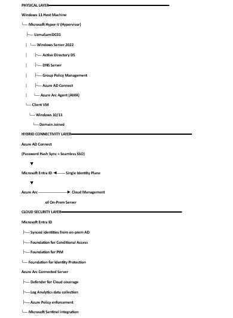

# Hybrid-identity-infrastructure
## Overview

This work documents the design and
implementation of a production hybrid identity
infrastructure — connecting an on-premises
Windows Server 2022 Active Directory environment
to Microsoft Entra ID (Azure AD) using Azure AD
Connect and Azure Arc.

Hybrid identity is not a feature you switch on.
It is an architectural decision that affects
every subsequent security control in your
environment. Get it wrong and your Zero Trust
implementation has blind spots. Get it right
and you have a single identity plane that
security controls can be built upon consistently
across cloud and on-premises.

## The Problem This Solves

Organisations that move to Azure without
establishing hybrid identity end up with two
separate identity systems running in parallel.

On-premises users authenticate to Active
Directory via Kerberos. Cloud users authenticate
to Entra ID via OAuth. Security policies applied
in the cloud do not reach on-premises resources.
Conditional Access cannot evaluate on-premises
sign-ins. Identity Protection cannot detect
risky behaviour that originates from the
corporate network. The SOC team monitors cloud
logs and on-premises logs in completely separate
tools with no correlation between them.

This fragmentation is not just an inconvenience.
It is a security gap. Attackers who understand
hybrid environments deliberately move laterally
between the on-premises and cloud planes
precisely because most organisations have
incomplete visibility at that boundary.

Hybrid identity closes that gap by establishing
a single authoritative identity source that
security controls can reference consistently
regardless of where a user is authenticating
from or what resource they are accessing.

---
## Architecture

---

## Why I Built It This Way

### The Hyper-V Decision

I chose Hyper-V over cloud-based lab
environments deliberately. Running virtual
machines locally on Hyper-V replicates the
actual on-premises infrastructure pattern
that exists in real enterprise environments.
A VM spun up in Azure is already a cloud
resource — it does not genuinely replicate
the hybrid connectivity challenge that this
project is designed to solve.

Hyper-V also meant zero recurring cloud cost
for the lab infrastructure itself, keeping
Azure spend focused on the services that
actually required it.

### The Domain Controller Design

Windows Server 2022 was selected as the
domain controller OS because it is the
current Microsoft-recommended platform and
the one most commonly found in enterprise
environments today. Running a genuine DC
rather than a simulated identity environment
meant that every Azure AD Connect behaviour,
every sync conflict, every Group Policy
interaction was real — not mocked.

The DC was configured with a dedicated
Organisational Unit structure from the
start. This was intentional. OU design
directly affects Azure AD Connect sync
filtering, Group Policy application scope,
and delegation of administrative rights.
Treating OU structure as an afterthought
is a common mistake that creates security
problems later.

### Azure AD Connect — Why Password Hash Sync

Three synchronisation methods exist:
Password Hash Synchronisation, Pass-Through
Authentication, and Federation with ADFS.

Federation provides the richest feature set
but requires additional ADFS infrastructure,
introduces a dependency on on-premises
availability for cloud authentication, and
significantly increases operational
complexity.

Pass-Through Authentication avoids storing
password hashes in the cloud but requires
on-premises authentication agents to be
available whenever a user signs in. If the
on-premises environment is unavailable,
cloud authentication fails.

Password Hash Synchronisation was the
correct choice for this environment. It
stores a hash of the password hash in
Entra ID, meaning cloud authentication
continues even if the on-premises
environment is completely offline. It also
enables Microsoft Entra ID Protection's
leaked credential detection — Microsoft
can compare synced password hashes against
known breached credential databases and
alert when a match is found. This security
capability alone justified the decision.

### Azure Arc — Extending the Cloud Plane

The alternative to Azure Arc was simple
log forwarding — sending Windows Event
Logs from the DC to a SIEM endpoint.
Log forwarding gives you data. Azure Arc
gives you management.

With Azure Arc the Domain Controller
appears in the Azure portal as a managed
resource. Azure Policy assignments reach
it. Defender for Cloud assesses it.
Secure Score includes it. Update Management
covers it. The server becomes a first-class
citizen of the Azure management plane
without being moved to Azure — which for
a Domain Controller would be architecturally
wrong.

---

## Implementation

### Active Directory Foundation

The domain was established with security
configuration applied from the start rather
than added later. Account lockout policy
was set to lock accounts after five failed
attempts with a thirty minute observation
window. Password complexity was enforced
with a minimum fourteen character
requirement. Audit policy was configured
to capture logon events, account management,
privilege use, and policy changes — the
event categories that Sentinel analytics
rules depend on downstream.

Group Policy was used to configure Windows
Firewall baseline rules, disable legacy
protocols including SMBv1, and enforce
consistent security settings across all
domain-joined machines. These baseline
hardening steps meant that by the time
Azure AD Connect and Arc were deployed,
the on-premises environment being extended
to the cloud was already in a known
security state.

### Azure AD Connect Synchronisation

Installation of Azure AD Connect was
preceded by running the IdFix tool against
the on-premises directory to identify and
resolve attribute conflicts that would
cause synchronisation errors. Common issues
such as duplicate proxy addresses and
invalid UPN suffixes were corrected before
the first sync run.

The synchronisation scope was configured
to exclude service accounts and privileged
administrative accounts from cloud sync.
Administrative accounts have no legitimate
need to authenticate to cloud services and
their exclusion reduces the attack surface
available to an adversary who might attempt
to leverage cloud authentication paths to
target privileged identities.

Seamless SSO was enabled during
configuration. This allows domain-joined
machines on the corporate network to
authenticate silently to Entra ID
applications using Kerberos tickets,
eliminating password prompts for users
accessing cloud resources from managed
devices.

Synchronisation health was verified using
Azure AD Connect Health, confirming
successful sync cycles, zero export errors,
and correct attribute flow from on-premises
AD objects to their cloud counterparts.

### Azure Arc Agent Deployment

The Azure Connected Machine Agent was
deployed to UzmaSamiDC01 after confirming
the required outbound connectivity to
Azure Arc endpoints. The agent was
registered to a dedicated resource group
with governance tags applied to support
cost attribution and policy targeting.

Following Arc registration three extensions
were deployed. The Microsoft Monitoring
Agent connects the server to the central
Log Analytics workspace, enabling security
event collection that flows into Sentinel.
The Microsoft Defender for Endpoint
extension enrolls the server in Defender
for Business providing endpoint detection
and response capability on the on-premises
DC. The Dependency Agent enables the
service map feature in Azure Monitor,
providing visibility into network
connections and process dependencies
running on the server.

---

## What the Hybrid Architecture Enables

Establishing hybrid identity is not an
end in itself. Its value is what it makes
possible in the security layers built on
top of it.

Conditional Access policies configured
in Entra ID can now evaluate every
authentication request including those
originating from on-premises. A user
authenticating from an unrecognised
location outside business hours triggers
the same risk evaluation regardless of
whether they are accessing a cloud
application or an on-premises resource
federated through Entra ID.

Identity Protection's risk signals now
cover the on-premises identity plane.
Leaked credential detection, atypical
travel detection, and anonymous IP
detection all become active for synced
users. A compromised on-premises
credential that appears in a breach
database will be flagged in the cloud
security portal.

Microsoft Sentinel receives security
events from the Domain Controller via
the Log Analytics agent installed through
Arc. This means on-premises events such
as failed logon attempts, account
lockouts, privilege escalation, and
Group Policy changes are correlated with
cloud signals in the same SIEM — closing
the visibility gap that hybrid environments
commonly suffer from.

---

## Security Considerations and Trade-offs

Hybrid identity introduces attack surface
that a purely cloud or purely on-premises
environment does not have. The most
significant risk is the Azure AD Connect
sync account. This account requires read
access to all Active Directory objects
including password hashes. If compromised
it could be used to enumerate the entire
directory or in sophisticated attacks to
manipulate objects that sync to the cloud.

I mitigated this by using a dedicated
least-privilege service account for the
sync engine, enabling auditing on all
actions performed by that account, and
creating Sentinel analytics rules that
alert on any unusual activity from the
sync account identity.

The second consideration is the expanded
attack surface created by Seamless SSO.
The AZUREADSSOACC computer account
created in Active Directory holds a
Kerberos decryption key that Azure uses
to validate SSO tokens. Compromise of
this account's keys could allow token
forgery. Microsoft recommends rotating
these keys every thirty days. I
implemented a scheduled task to perform
this rotation automatically.

---

## Lessons Learned

The most valuable lesson from this project
was that hybrid identity planning must
precede hybrid identity implementation by
a significant margin. Decisions made early
— OU structure, sync scope, service account
design, naming conventions — are expensive
to change later because they cascade
through every dependent system.

The second lesson was that the IdFix
remediation step before initial sync is
not optional. In a real Active Directory
that has grown organically over years,
attribute conflicts are common. Running
a first sync without remediation produces
errors that can be difficult to clean up
and in some cases can affect the user
experience for cloud services immediately.

The third was specific to Azure Arc — the
agent deployment prerequisites,
particularly around TLS inspection by
proxy servers, are a common failure point
in enterprise environments. Understanding
the outbound connectivity requirements and
testing them before deployment saves
significant troubleshooting time.

---

## What I Would Do Differently at Scale

At enterprise scale with hundreds of
servers and multiple AD forests I would
introduce several changes to this
architecture.

Azure AD Connect would be deployed in
high availability configuration with a
staging server — a second sync instance
that receives all changes but does not
export them, providing an immediate
failover path if the primary server fails.

Arc onboarding would be automated using
the Arc onboarding script at scale combined
with Azure Policy to detect any on-premises
servers registered to Azure that do not
have the Arc agent installed, triggering
automatic remediation.

The Seamless SSO key rotation would be
integrated into a formal secrets management
process rather than a standalone scheduled
task, ensuring rotation history is tracked
and rotation failures are alerted.

---

Uzma Shabbir
Azure Security Engineer | AZ-104 | AZ-500
[GitHub](https://github.com/UzmaSami) •
[LinkedIn](https://linkedin.com/in/uzma-shabbir-034361128)
